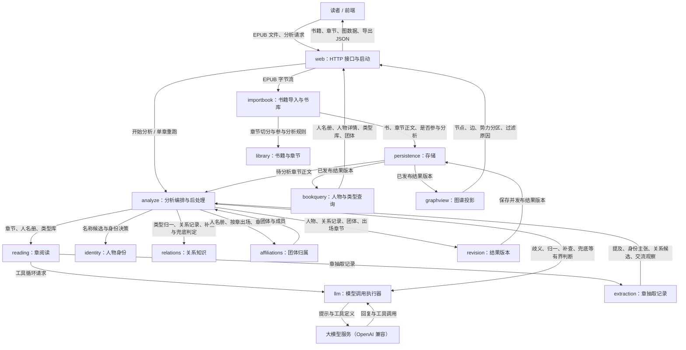

# ZhiYing 架构总览

## 项目说明

ZhiYing 面向想读中长篇小说、但被人物和称呼绕晕的读者：上传一本 EPUB，系统自动认人、判断人物关系并生成可过滤、可解释的关系图，用户不需要人工校对。

系统由两部分组成：Kotlin 后端 `zhiying_backend/`（模块化单体）负责书籍导入、调用大模型逐章分析、汇总人物与关系、按结果版本发布，并通过 HTTP 提供给 React 前端 `frontend/`；前端负责书架、关系图浏览与分析进度展示。本文主要写后端，前端见末尾「前端」一节。产品范围见 [PRD](./PRD.md)，领域模型与分析流程细节见 [DESIGN](./DESIGN.md)。

当前进度（2026-10-07）：从上传、整书分析（阅读单元调度、滚动人名册、后处理模型判断、团体归纳）到发布、出图与人物 / 类型 / 团体查询已全链路打通，并用真实模型跑通过单章重跑；前端已接入新接口，旧 Python 后端已删除。验收场景尚未落为测试。

## 数据流

上传的 EPUB 拆成章节保存；分析编排逐章交给章阅读（大模型多轮工具循环）得到章抽取记录，再由后处理规则在全书范围内完成身份对齐、类型归一、有限补查与软关系兜底，组装成一套一致的结果版本并发布；全书读完后再做团体归纳；出图与人物 / 类型 / 团体查询只读已发布版本。

## 核心子系统与职责

分层规则：编译依赖为 `web → application → domain`、`infrastructure → application → domain`，`web` 只在运行时装配 `infrastructure`；`domain` 只做纯计算，不依赖框架、网络、文件、数据库。外部能力接口定义在使用它的应用层业务包内，由基础设施实现。编码约束见根目录 `AGENTS.md`。

基础约定：
- **错误码**：对外错误统一登记在 `application` 的 `ErrorCode`，用例拒绝请求时抛 `AppException(code)`；`web` 的 `ApiExceptionHandler` 是错误码到 HTTP 状态的唯一映射，响应为带 `code` 字段的 ProblemDetail。模型调用的执行失败（`ModelFailure`）是业务结果，不是错误码。
- **配置**：项目自有可调参数统一放在 `zhiying.*`，由 `infrastructure` 的 `ZhiYingProperties` 类型化绑定并在启动时校验，不使用散落的 `@Value`；应用层需要的参数由基础设施组装成应用层自己的设置对象注入。
- **不建 common 模块**：值对象放 `domain`，错误码放 `application`，技术工具放 `infrastructure`。

### web · HTTP 接口与启动

- **实现状态**：已完成。
- **覆盖范围**：`com/zhiying/web`、`com/zhiying/ZhiYingApplication`。
- **职责**：Spring Boot 启动与依赖装配、路由、请求 / 响应 DTO、错误映射。书籍上传、查询、删除与清空分析，分析启动 / 取消 / 单章重跑、任务快照、进度推送（SSE）、章抽取结果、图与导出、人名册与人物详情、关系类型、团体、模型诊断接口。
- **对应位置**：`web/`（`com.zhiying.web.books`、`web.analysis`、`web.graph`、`web.cast`、`web.types`、`web.factions`、`web.diagnostics`、`web.error`）。

[探索这个子系统](#module=com/zhiying/web)

### importbook · 书籍导入与书库

- **实现状态**：已完成。
- **覆盖范围**：`com/zhiying/application/importbook`、`com/zhiying/application/library`、`com/zhiying/application/removal`、`com/zhiying/infrastructure/epub`。
- **职责**：解析 EPUB（阅读顺序、目录标题、正文清洗、按标题或章节标记切章），判定每章是否参与分析并给出原因，保存书与正文；提供书籍、章节与章节正文的查询，供章阅读读取。删除书与清空分析（`removal`）：有运行中任务时拒绝，按书删除记录在一个事务内完成（`persistence.SqliteBookDataEraser`），源文件不再被引用时一并删除。
- **对应位置**：`application/…/importbook`、`application/…/library`、`application/…/removal`、`infrastructure/…/epub`。

[探索这个子系统](#module=com/zhiying/application/importbook)

### analyze · 分析编排与后处理

- **实现状态**：已完成。
- **覆盖范围**：`com/zhiying/application/analyze`、`com/zhiying/infrastructure/llm/analysis`、`com/zhiying/infrastructure/persistence/analysis`。
- **职责**：整书分析与单章重跑（`run`）：章节切成阅读单元按阅读顺序进并发池，首单元暖启动，每单元完成后做确定性身份对齐更新人名册快照；同书同时只允许一个任务，支持取消、SSE 进度、复用未失效的章抽取，有章失败时不发布。读完后由 `AnalysisPostProcessorFactory` 创建的 `AnalysisPostProcessor` 依次做身份对齐、类型归一、关系记录构建、有限补查、软兜底并组装结果版本，四个模型判断端口由 `infrastructure.llm.analysis` 实现，类型语义决策缓存在 SQLite；最后团体归纳并发布。
- **对应位置**：`application/…/analyze`（`run`、`identity`、`relations` 子包）、`infrastructure/…/llm/analysis`、`infrastructure/…/persistence/analysis`。

[探索这个子系统](#module=com/zhiying/application/analyze)

### reading · 章阅读

- **实现状态**：已完成。
- **覆盖范围**：`com/zhiying/application/analyze/reading`、`com/zhiying/infrastructure/llm/reading`。
- **职责**：端口 `ChapterReader` 把一章正文读成章抽取记录：章阅读 Agent 在本章会话内按需读正文、搜索、查人名册、登记人物与别名、提交关系与交流观察；长章按段读取时只负责本段，搜索与取证覆盖整章。工具在边界校验人物编号、类型与引文并把结构化错误返回给模型修正。
- **对应位置**：`application/…/analyze/reading`、`infrastructure/…/llm/reading`。

[探索这个子系统](#module=com/zhiying/infrastructure/llm/reading)

### llm · 模型调用执行器

- **实现状态**：已完成。
- **覆盖范围**：`com/zhiying/infrastructure/llm`、`com/zhiying/application/llm`。
- **职责**：通过 Spring AI 以 OpenAI 兼容协议调用模型；提供单次请求入口（并发、预算、取消、重试退避、用量统计、失败归类）、结构化调用执行器（解析失败自动重答）与工具循环执行器；应用层用 `ModelCallControl` 传入预算与取消信号。也包含模型连通性探针。
- **对应位置**：`infrastructure/…/llm`、`application/…/llm`。

[探索这个子系统](#module=com/zhiying/infrastructure/llm)

### persistence · 存储

- **实现状态**：已完成。
- **职责**：SQLite 数据源与建表脚本（`resources/schema/*.sql`，启动时执行）；书与章节（`library`）、结果版本与发布指针（`revision`）的存储，源 EPUB 按内容摘要存文件。章抽取记录（按章存 JSON，重跑产生新记录，当前指针指向最新）、分析任务与各章进度、书的分析状态存储在 `persistence.analysis`。
- **对应位置**：`infrastructure/…/persistence`。

[探索这个子系统](#module=com/zhiying/infrastructure/persistence)

### diagnostics · 模型诊断

- **实现状态**：已完成。
- **职责**：检查模型服务能否完成对话、工具调用与结构化输出，供部署和调试时确认配置可用。
- **对应位置**：`application/`（`com.zhiying.application.diagnostics`）。

[探索这个子系统](#module=com/zhiying/application/diagnostics)

### library · 书籍与章节

- **实现状态**：已完成。
- **职责**：书、章节、正文区间、证据引用等值对象及其不变量，摘录定位，以及章节是否参与分析的判定规则。
- **对应位置**：`domain/`（`com.zhiying.domain.library`）。

[探索这个子系统](#module=com/zhiying/domain/library)

### extraction · 章抽取记录

- **实现状态**：已完成。
- **职责**：一章一次读取得到的原始观察（人物提及与身份主张、关系候选及章内首次判断、交流观察、摘要），提交后不被改写；单独成包避免人物与关系之间的循环依赖。
- **对应位置**：`domain/`（`com.zhiying.domain.extraction`）。

[探索这个子系统](#module=com/zhiying/domain/extraction)

### identity · 人物身份

- **实现状态**：已完成。
- **职责**：人物、名称绑定、名称索引、身份决策与身份映射，以及身份对齐规则（明确绑定直接采用，同名只产生候选，真正歧义才交给判断）。
- **对应位置**：`domain/`（`com.zhiying.domain.identity`）。

[探索这个子系统](#module=com/zhiying/domain/identity)

### relations · 关系知识

- **实现状态**：已完成。
- **职责**：内置 59 个关系类型与本书新类型、类型归一与方向映射、关系记录构建与准入、有限补查与软关系兜底的判定规则。
- **对应位置**：`domain/`（`com.zhiying.domain.relations`）。

[探索这个子系统](#module=com/zhiying/domain/relations)

### affiliations · 团体归属

- **实现状态**：已完成。
- **覆盖范围**：`com/zhiying/domain/affiliations`、`com/zhiying/application/analyze/affiliations`、`com/zhiying/infrastructure/llm/affiliations`。
- **职责**：学校、机构、家族等团体及人物成员关系，一人可多归属，与关系边正交。全书读完后由模型一次归纳团体与成员（输入为人名册、按章出场、章摘要，过大时有界裁剪），程序校验后写入结果版本；失败时沿用无团体的版本，分区按规则降级。
- **对应位置**：`domain/…/affiliations`、`application/…/analyze/affiliations`、`infrastructure/…/llm/affiliations`。

[探索这个子系统](#module=com/zhiying/domain/affiliations)

### revision · 结果版本

- **实现状态**：已完成。
- **职责**：一次分析产出的一整套一致结果（人物、类型库、关系记录、团体、出场章节、章序），建立时校验引用完整；后处理负责组装，出图只读已发布版本。
- **对应位置**：`domain/`（`com.zhiying.domain.revision`）。

[探索这个子系统](#module=com/zhiying/domain/revision)

### graphview · 图谱投影

- **实现状态**：已完成。
- **覆盖范围**：`com/zhiying/domain/graph`、`com/zhiying/application/graphquery`。
- **职责**：从已发布结果版本生成图数据：多标签汇总、展示分排序、软标签折叠、按章计数的路人过滤、聚焦与类型 / 硬度筛选、势力分区（团体优先，无团体时按阶段推断，无法分区时降级并标明）；页面与 JSON 导出共用同一结果。结果版本的保存与发布端口也定义在这里。
- **对应位置**：`domain/…/graph`、`application/…/graphquery`。

[探索这个子系统](#module=com/zhiying/domain/graph)

### bookquery · 人物与类型查询

- **实现状态**：已完成。
- **覆盖范围**：`com/zhiying/application/bookquery`。
- **职责**：从已发布结果版本读出人名册（含出场章数与所属团体）、人物详情（全部关系事实与证据）、本书类型库及使用次数、团体与成员；没有已发布版本时返回空结果。
- **对应位置**：`application/…/bookquery`、`web/`（`web.cast`、`web.types`、`web.factions`）。

[探索这个子系统](#module=com/zhiying/application/bookquery)

## 数据模型

一本书有多个章节；每章每次分析产生一份章抽取记录。抽取中的人物提及经身份映射归到书内人物，关系候选经类型归一与语义判断形成章账本记录，通过准入的记录按「人物 A、人物 B、关系类型」聚合成关系事实。人物可属于多个团体。一次分析构建一个结果版本，发布后成为出图的唯一来源。字段与不变量见 [DESIGN §2](./DESIGN.md)。

## 技术栈

| 技术 | 用途 |
| :--- | :--- |
| Kotlin 2.4 / JDK 21 | 后端语言与运行时；四个 Gradle 模块对应四层 |
| Spring Boot 4（Web MVC） | HTTP 接口与依赖装配，只用于 `web` 与 `infrastructure` |
| Spring AI 2（OpenAI 兼容协议） | 模型接入，当前接 DeepSeek；通过 `LLM_BASE_URL` / `LLM_API_KEY` / `LLM_MODEL` 切换 |
| SQLite + `JdbcClient` + 文件 | 结构化记录与章节正文走 SQLite，访问只用 Spring `JdbcClient`（查询少，不引入 ORM）；表结构由 `resources/schema/*.sql` 启动时建立，不用迁移工具，结构变更直接删库重建；源 EPUB 按内容摘要存文件 |
| jsoup | 解析 EPUB 内的 XHTML |
| SSE | 分析进度推送（Spring MVC `SseEmitter`，事件带递增 id，断线按 Last-Event-ID 回放） |
| crap | 提交时的函数复杂度门禁，阈值见 `crap.toml` |
| React 19 + TypeScript + Vite + AntV G6 5 | 前端（`frontend/`），见「前端」一节 |

## 常用运行命令速查

在 `zhiying_backend/` 目录执行；以下命令依据构建配置整理，本次未实际运行。

| 场景 | 命令 | 必要说明 |
| :--- | :--- | :--- |
| 启动项目 | `./gradlew :web:bootRun` | 先把 `.env.example` 复制为 `.env` 并填写模型配置 |
| 验收或测试 | `./gradlew test` | 目前尚无测试用例 |
| 复杂度门禁 | `crap check` | 提交时由钩子自动执行，见 `CRAP_GUIDE.md` |
| 构建或打包 | `./gradlew build` | 可执行包由 `web` 模块产出 |

## 前端

`frontend/` 是单页应用，开发时由 Vite 把 `/api` 代理到后端 8080。只做展示与交互，不做分析计算；图数据的过滤、分区、路人判断都以后端返回为准，前端只按当前视图（势力筛选、中心人物）裁剪与布局。

| 位置 | 职责 |
| :--- | :--- |
| `src/api.ts` | 后端客户端：所有 HTTP / SSE 调用，接口字段到前端类型的转换集中在这里 |
| `src/state/` | 全局状态：当前书、章节聚焦与过滤、图数据、选中与人物聚焦、侧栏页签、分析任务 |
| `src/hooks/` | 按数据源拆的读取与订阅（书架、图、人名册、章节、章节结果、关系类型、分析进度）；`analysisMock.ts` 为开发用的假进度 |
| `src/components/GraphView/`、`src/graphLayout.ts`、`src/factions.ts` | 关系图：场景编排、布局几何、势力配色、相机、样式与图例，基于 G6 渲染 |
| `src/components/` 其余 | 顶栏、书架与上传、章节聚焦条、图工具栏与筛选、侧栏（人物、章节、详情）、分析进度 |
| `src/styles/`、`src/theme.ts` | 设计变量与样式；主题在跟随系统 / 浅 / 深之间切换 |

| 场景 | 命令（在 `frontend/` 执行） |
| :--- | :--- |
| 开发 | `npm run dev` |
| 类型检查并构建 | `npm run build` |
| Lint | `npm run lint` |
