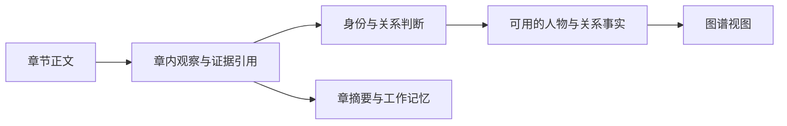
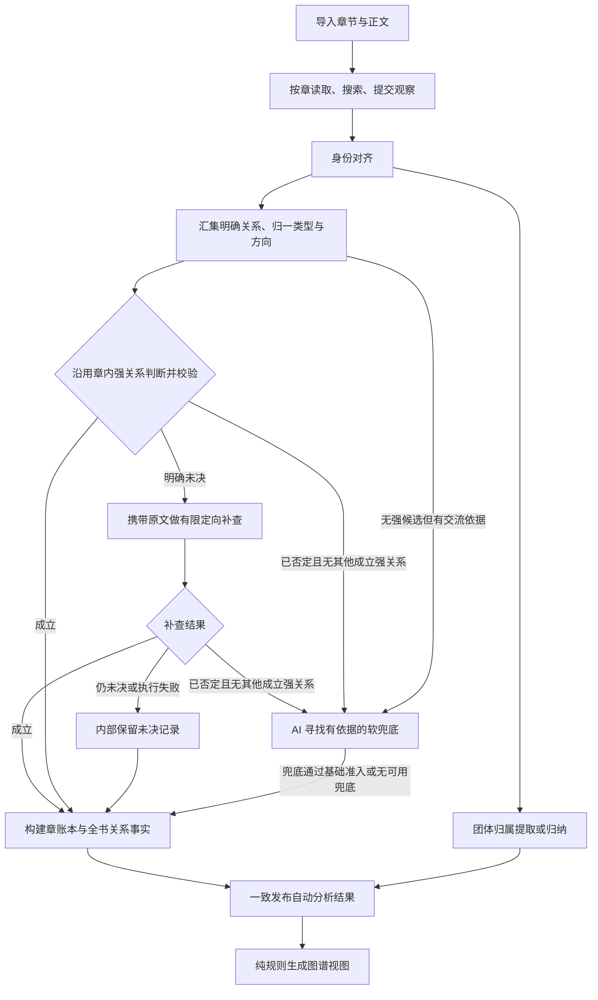

# ZhiYing 设计

| 项 | 内容 |
|---|---|
| 依据 | [PRD](./PRD.md)（产品行为唯一来源） |
| 状态 | Kotlin 重构设计；领域模型初版已在 `zhiying_backend/domain`，业务用例尚未实施 |
| 分工 | 本文写「系统怎么做」：领域模型、分析流程、模型调用点、存储与重跑。模块分层与技术选型见 [ARCHITECTURE](./ARCHITECTURE.md)；实施顺序与待定事项见 [todo](./todo.md) |

产品规则（软关系兜底、基础证据、不做人工纠错等）只写在 PRD，本文引用章节号，不重复抄写。设计变更直接改本文，不再新开平行设计稿。

---

## 1. 设计主线

旧 Python 实现的根本问题是：同一个关系对象同时充当模型输入、抽取记录、归一结果、验证状态、落盘结构与接口返回，多个阶段就地改写它；名称被当成身份；一个通用收尾 Agent 用补丁同时改人物、关系和证据。逐文件翻译成 Kotlin 会保留这些耦合。

因此新设计的主线是**把观察、判断、事实、视图分开**：

- 章内观察只是候选，保存成功不等于成立。
- 图是正式结果的派生视图；摘要只提供上下文，关系结论必须回到正文依据（PRD §4.3）。
- 这些是语义边界，不要求每个概念一张表、一个服务或一次模型调用。

旧实现中已核实的问题与新设计的对应处理：

| 旧问题 | 新设计 |
|---|---|
| 正式名相同就合并，别名查询取第一个结果 | 名称索引返回候选集合，由身份决策绑定 ID（§2.2、§3.2） |
| 抽取提示没有类型列表，关系不断造词 | 章阅读优先引用类型库，新类型单独提交建议（§3.1） |
| 原句定位失败会把关系重置为待确认，归类与核对都以唯一定位为前置 | 引文有效性、语义成立、准入政策是三个独立结果（§2.4） |
| 按章归类，缺少全书语义去重 | 全书汇集后归一，类型缓存与证据判断缓存分开（§3.3） |
| 通用收尾校对通过补丁改多份数据 | 取消；身份歧义归身份解析，摘录错误在提交时退回，语义疑点有限补查（§3.4） |
| 类型没有硬度，展示分只排序，路人过滤被轻易绕过 | 类型带硬度，显示策略按 PRD §5.7.7 例外规则执行（§3.6） |
| 书、任务、章、校对状态互相嵌套，调度器同时管 SSE、存储、发布 | 任务运行与结果版本分开，阶段只是进度信息（§2.6、§5） |

旧实现中应保留的能力：原始抽取快照、单章缓存、有限并发、请求预算、任务进度与重跑隔离。保留的是能力，不是旧文件布局。

---

## 2. 领域模型

### 2.1 书籍、章节与摘录

| 模型 | 关键字段 | 不变量 |
|---|---|---|
| `Book` | `BookId`、标题、作者、源文件引用 | 书的身份不随分析任务改变；不塞入任务运行状态 |
| `Chapter` | `ChapterId`、书 ID、顺序、标题、正文版本 | 章节 ID 与排序分开；导入修订不能悄悄改变已有引用含义 |
| `TextSpan` | 章节 ID、正文版本、起止位置、坐标单位 | 区间属于该版本正文；起点小于终点且不越界 |
| `EvidenceRef` | 证据 ID、原文片段集合，或基础模式的章节与说明 | 有引文时由程序按区间读取，各片段分离；无引文时不得伪造定位成功 |
| `ChapterExtraction` | 抽取 ID、章节 / 正文版本、模型与提示版本、观察集合 | 已提交的原始记录不被后处理就地改写；重跑产生新记录 |
| `ChapterSummary` | 章节 ID、摘要、所属抽取版本 | 仅用于记忆，不作为关系来源 |

- 「哪些章值得分析」是可检查的章节选择结果。旧实现「少于 200 字直接丢弃」之类阈值没有产品依据，实施前用短章、序章、目录混排样例确定规则。
- 证据工具优先让模型选择程序返回的片段 ID，也可提交摘录与位置由程序核实。同一句重复出现时按位置选定，不能因出现两次就判无效。
- 字符坐标必须明确单位：Kotlin `Char` 是 UTF-16 代码单元，补充平面字符占两个位置，旧 Python 位置不能直接当下标。评测样例复用旧位置时按正文版本和引文重新定位；测试覆盖扩展汉字、表情、换行与 EPUB 文本清洗。

### 2.2 人物与名字

| 模型 | 关键字段 | 用途 |
|---|---|---|
| `PersonMention` | 提及 ID、章内局部人物 ID、称呼、上下文与来源 | 本章提到了谁，含无姓名但可稳定识别的人物；不必覆盖每个代词 |
| `Person` | 稳定 `PersonId`、正式名或稳定称呼、别名、简介、性别、重要度 | 书内人物身份与当前资料 |
| `NameBinding` | 名称、人物 ID、名称种类、来源章、归属依据 | 已成立的正式名 / 别名 / 稳定称谓；按名称检索返回候选集合，名称不唯一 |
| `IdentityDecision` | 被处理的提及 / 人物、同人 / 不同人 / 未决、依据 | 谁与谁是同一个人，保留决策来源 |
| `IdentityMap` | 局部人物引用 → 书内人物 ID | 所有关系端点都通过同一份映射解析 |

- 人物 ID 独立于展示名；后来补充正式姓名不新建身份。`Person` 的别名列表由名称绑定投影，避免两套写入来源。
- 「父亲 / 师父 / 那个老人」的单次指向记录在 `PersonMention` 与身份映射中，不写成全书别名（PRD §5.3）。
- 候选组不等于合并组：A 像 B、B 像 C，推不出三者同人。模型可返回多个子组与未决项，程序校验覆盖范围、未知 ID 与矛盾决策。
- 正式名、别名直接桥接候选；稳定称呼只在共用它的人物不超过上限（默认 4，可配）时桥接，「仆人」「老板娘」这类多人共用的泛称不桥接。
- 简介、性别、重要度随身份主张写入人物，只补空缺；重要人物的全书简介在后处理统一生成（§3.2）。
- 合并不靠全项目替换 ID：保留稳定身份引用与合并映射，结果构建时统一重映射关系、事件和团体成员；合并后产生自环的关系需重新处理。
- 只做来源追踪与当前身份映射，不实现按章节回放的历史人名册。

### 2.3 关系、类型与互动

| 模型 | 关键字段 | 边界 |
|---|---|---|
| `RelationType` | 类型 ID、定义、硬度、方向、两端角色、同义名、内置 / 书内来源 | 半开放数据，不能写死为 Kotlin 枚举 |
| `RelationCandidate` | 候选 ID、局部人物端点、已知类型或新类型建议、原文描述、证据 | 原始观察，不带模型自定的「已确认」标志 |
| `InteractionObservation` | 两个人物、交流描述、证据 | 软兜底的输入，不自动入账为关系 |
| `TypeResolution` | 候选 ID、规范类型、端点方向映射、理由 | 回答「属于什么关系」，不回答「是否成立」 |
| `RelationAssessment` | 候选 ID、语义结论、依据、未决原因、判断来源 | 章内首次判断或定向补查结论；不强制独立模型调用 |
| `RelationOccurrence` | 稳定记录 ID、人物端点、类型、来源章、证据、判断引用 | 章账本中的关系记录，未决 / 否定记录也保留以便追踪 |
| `RelationFact` | 关系键、通过准入的记录 ID 集合 | 出图用的关系事实；同一对人物可多种并存 |

- 关系键为 `(BookId, PersonId A, PersonId B, RelationTypeId)`，按键合并章节与证据。无向关系统一端点顺序；有向关系按类型定义的角色顺序存储，「甲是乙的父亲」与「乙是甲的孩子」须经角色转换再归一，不能一律排序。
- 硬度只是产品分类与显示规则，证据支持度是另一维：「亲子」可以未决，「相识」可以证据充分。
- 不推导完整亲属逻辑系统，也不把行为建成类型。「告别后走入树林」是事件，可作为判断上下文，不成为关系类型。

### 2.4 三种结果分开，不做大状态机

| 问题 | 结果类型 | 处理者 |
|---|---|---|
| 输入是否合法、引用是否有效 | 合法 / 结构错误 / 引用错误 | 程序，在工具边界即时反馈 |
| 语义是否成立 | 有支持 / 未决及原因 / 有反证 | 语义判断，必要时有限补查 |
| 是否满足准入 | 准入 / 尚不满足及原因 | 程序按基础证据条件（PRD §5.6）与判断结果决定 |

- 超时、取消、预算耗尽是执行结果，不等于「原文无法证明」。缺引文在基础模式下不等于不成立；提交对不上的引文仍是输入错误。
- 用 `sealed interface` 表达带理由的结果分支，用 `@JvmInline value class` 区分各类 ID。
- 领域对象是不可变快照；外部 JSON、持久化记录、领域对象、HTTP 返回在各自边界映射。

### 2.5 团体与图数据

| 模型 | 职责 |
|---|---|
| `AffiliationGroup` | 学校、机构、家族、生活圈等团体及名称来源 |
| `Membership` | 人物属于某团体的记录、角色、依据；一人可多条 |
| `LayoutPartition` | 当前图如何分块；区分显式团体与算法推断分区 |
| `GraphView` | 节点、边、可见标签、折叠标签、分区、过滤原因、导出范围 |

- 团体事实与布局推断分开：为摆图把某人放进某块，不证明他属于该组织。成员事实需回到正文，不能从已过滤的默认图倒推。
- `GraphView` 只读正式结果：先聚合多标签，再折叠软标签、过滤人物。未决记录与「已成立但默认折叠的软关系」必须分开，前者不能借「更多」混进图里。

### 2.6 任务与结果版本

- `AnalysisRun`：一次执行的范围、输入版本、预算、进度、章尝试、失败原因、取消情况。状态只有等待 / 运行 / 完成 / 失败 / 取消，完成时另带完整 / 部分说明。
- `ChapterAttempt`：某章一次尝试及抽取产物引用；一章失败不等于其他章失败。
- `AnalysisRevision`：一套彼此一致的人物映射、关系结果、类型定义和团体结果，记录输入抽取与策略版本。
- `PublishedRevision`：当前对外可读结果的指针。

章节覆盖、未决数、势力是否过期属于结果质量信息，不复用同一个状态字符串。任务失败时上一版已发布结果仍可读。

本期不设计人工编辑覆盖层（`Correction`）与审核队列。

---

## 3. 分析流程

旧主路径：并行抽取 → 同名合并 → 按章归类 → 逐批核对 → 通用校对补丁 → 势力抽取 → 出图。

新流程（图中是职责顺序，不代表每个框一次模型调用）：

### 3.1 章阅读

输入：章节正文、人名册、类型库、预算；长篇时可加记忆（见下）。章 Agent 自行决定阅读、搜索与取证方式（PRD §4.2「过程松、出口紧」）。

章 Agent 可用的工具：按章 / 分段取正文、章内按人名与关键词搜索、查人名册、登记人物与别名、提交本章结果。工具处理器持有本章范围内的上下文，没有全库写权限；校验失败返回结构化错误供本轮修正。

输出三类加一份摘要：
1. 人物观察及名称归属；
2. 明确关系候选，带首次语义判断；
3. 可供兜底的实际交流观察，只保留足够支撑判断的片段，不建全量事件抽取。

规则：
- 高频关系优先引用类型库；新类型提交定义、角色与方向，不能把情节句子当标签。
- 已知有硬 / 中关系的人物对，不要求再生成软标签；交流观察不提前命名为「朋友」。
- 错人物 ID、越界片段、错引文在工具边界退回。正常候选与失败的工具调用分开保存。
- 基础证据准入：章节 + 非空说明，引文可选；提供引文时校验真实性。
- 新登记且作为关系候选端点的人物必须给本章简介，缺失时提交被工具退回；其他人物有依据就写（PRD §5.3）。

**阅读单元与调度：**
- 阅读单元是一章或长章的一段。不超过切段上限的章整章一个单元；超长章先定段数 n = ⌈字数 / 上限⌉ 再均分，切点按场景分隔行 → 段落 → 句末标点 → 硬切依次退让。短章不合并，来源、引文、重跑都以章为单位。纯规则，不做语义切片。
- 段单元只负责本段抽取，搜索、取证与引文校验覆盖整章；段首附上一段末尾一小段作提示，不归它抽取。同一章各段按顺序读：前一段完成并更新人名册后才启动后一段，后一段可直接绑定前一段登记的人物；不同章之间照常并行。同一章各段的抽取合并为一份章抽取（局部人物与候选按段加前缀），对外仍是一章一份结果。
- 滚动人名册：单元按阅读顺序排队进并发池，没有波次屏障。每个单元完成后立即做一次身份对齐的确定性部分（复用明确绑定，不调模型）更新人名册快照，之后启动的单元拿最新快照。第一个单元单独先读（暖启动），再放开并发。
- 注入方式：提示内只列精简名册（有上限，按重要度），其余用 `query_roster` 检索；绑定已有 ID 须给理由。局部绑定会因完成先后略有差异，由全书读完后的身份对齐统一复核。
- 单章重跑注入当前已发布版本的人名册，保持人物 ID 稳定。

**长篇记忆（二期）：** 第 k 章上下文 ≈ 大摘要 + 最近若干章细摘要 + 人名册摘要；摘要过长时压缩为大摘要。一期各单元不注入摘要，只注入人名册。

### 3.2 身份对齐

章阅读同时完成主要身份判断：返回局部人物、名称归属、来源章、简短理由与可匹配的已有 ID。程序按名称检索候选并复用明确绑定；命中已有 ID 时也要保存新别名。

读章期间只做确定性对齐（见 §3.1 滚动人名册）；歧义判断等全书读完后统一进行。同名或别名交叉只产生候选。真正有歧义时，应用预先打包候选人物资料、相关提及及各自原文上下文，模型返回结构化身份结论，程序校验后更新映射。不对全部名字再审一遍，不启动自由翻书的 Agent。批量处理有条数与输入长度上限，逐项保存；信息不足时保持独立，不阻断其他人物出图。

提示里的人物用短代号（P1、P2……）而非人物 ID：长 ID 会被模型改写（如丢前缀）导致结论被当作未知人物丢弃。需要模型回传人物的调用点（身份歧义、疑似强关系的源端）一律如此，程序按代号映射回 ID，也接受完整 ID。

**全书简介：** 关系、补查与兜底定下后，为重要人物（出场章数 ≥ `core-min-appearance`，或有已成立的硬 / 中关系）生成全书简介：输入为该人物各章的简介与提及依据（按阅读顺序），有界小批结构化输出，不读原文。路人沿用首次出场章的简介，可为空。生成失败或预算耗尽时保留章内简介，不阻断发布。单章重跑只重写在重跑章出场的重要人物，其余沿用上一版。

### 3.3 全书关系归一

在本次分析范围内汇集候选：先精确去重、确定性匹配已有类型，再对剩余语义相近的描述组织有界批次判断。

| 缓存 | 适用范围 |
|---|---|
| 类型语义决策 | 定义、角色、方向等价的问题跨章复用；类型库或策略变更时失效 |
| 证据语义判断 | 仅在人物解释、规范类型、正文版本、证据上下文都相同时复用 |
| 章抽取 | 正文、输入、提示、模型配置未变时复用 |

「多章都用了朋友这个词」可共享类型定义，不能共享「这些人确实是朋友」的结论。身份合并或类型方向变化后，相关证据判断重新校验。

清晰候选沿用章内首次判断，经结构与基础证据校验后直接准入，不设全量复核门禁（PRD §5.6）。

### 3.4 有限补查

只处理明确未决的硬 / 中关系。未决原因用有限类型表达：

| 原因 | 后续动作 |
|---|---|
| 指代或说话者不明 | 回到身份上下文，补相邻对话或相关提及 |
| 类型 / 方向含糊 | 附类型定义与双方角色，重新判断 |
| 当前片段不足 | 扩充到句子 / 段落，必要时由应用准备有限的相关章节片段 |
| 比喻、尊称、传闻 | 针对疑点补查；仍不足则保留未决 |
| 供应商失败 / 超时 | 走执行重试，不伪造语义否定 |
| 摘录不合法 | 原工具当场反馈，不进入补查 |

- 应用在调用前准备：候选 ID、具体疑问、首次判断及理由、人物与别名、来源章与相关原文。上下文从原句、相邻句、所在段落开始，按对话边界处理指代，有界扩展；不硬编码「前后各两句」。
- 单项或有界小批，条数、输入长度、请求次数、耗时上限由应用控制，具体数值实施时定。逐项保存，不再复核补查结果；单项未决或失败不回滚其他判断。

### 3.5 软关系兜底

产品规则见 PRD §5.5，这里只写判定时机：

| 人物对的情况 | 处理 |
|---|---|
| 已有成立的硬 / 中关系 | 不生成新软关系；历史软记录保留、默认折叠 |
| 两端都是路人（出场章数低于阈值），有交流依据 | 不调模型，直接记最粗的软标签（相识），来源为交流观察 |
| 至少一端是重要人物，无硬 / 中候选，有足够交流依据 | AI 先查漏：判断为疑似硬 / 中关系时生成强候选，附原文走补查；否则生成粗粒度兜底标签，须通过基础准入 |
| 只是同章共现 | 不补边 |
| 有未决硬 / 中候选 | 先等后续判断，不抢先生成软关系 |
| 强候选被否定，且无其他成立强关系 | AI 回看交流与上下文寻找兜底 |
| 仍未决 / 超时 / 预算耗尽 | 内部保留，不当作否定触发兜底 |
| AI 找不到有依据的兜底 | 不连边，保留强关系被否定的记录 |

- 「历史已有」指之前已入账的记录，不能先把本轮交流观察都转成软关系再宣称要保留。并行章节完成的先后不应影响最终生成多少软标签。
- 软关系记录首次准入及来源；来源在重跑中失效时重新评估，不无条件保留。
- 各章仍可并行收集交流证据，不为确认「已有强关系」而串行化读章。
- 重要人物 / 路人按全书对齐后的出场章数划分，阈值默认与出图默认过滤相同（PRD §5.7.7），可配置。
- 查漏升级出的强候选只补查一轮：成立则入账，否定或未决则回落到软兜底 / 内部保留，不再循环。

### 3.6 出图与团体

应用用例加载同一结果版本，由领域纯函数完成：人物归一 → 多标签汇总 → 软标签折叠 → 人物过滤 → 聚焦 / 类型筛选 → 分区数据。

- 相同类型合并出现章节与证据；多种硬 / 中关系并列保留。
- 展示分 ≈ 类型基础分（硬 > 中 > 软）+ 出现章数 × 系数 + 有合格证据加分。只用于排序与默认过滤，不能决定事实成立，也不能让一种硬关系吞掉另一种。
- 人物出现次数按章去重；默认阈值、例外保留见 PRD §5.7.7。一条软边不能让普通人物绕过过滤。
- 导出 JSON 与页面共用同一份图数据构建结果。
- 团体归纳是全书级独立步骤（逐章猜会造出不一致的块名），输入为人名册、按章出场、章摘要与章内观察，输出区分团体事实与布局推断。分区失败的降级按 PRD §4.4。

章节聚焦（PRD §5.7.1）是同一结果版本上的查询条件，不生成新版本、不调模型：

- 投影前先按截止章 N 裁剪：关系记录只留章节 ≤ N 的出现与依据（全部被裁掉的标签不进图），人物出场集合也只数 ≤ N 的章。展示分按裁剪后的章数重算。
- 单章模式：人物限定为第 N 章出场者，不做路人阈值过滤；标签标记是否含第 N 章依据（本章 / 背景）；节点简介置空，由前端展示章摘要。
- 累计模式：人物为前 N 章出场者，路人阈值按前 N 章内的出场章数判定。
- 团体归属、称呼、重要度沿用全书结果，因此不构成严格防剧透；严格防剧透需按章生成快照，后续另行设计。

---

## 4. 模型调用点

Agent 只是基础设施里的一种执行方式（多轮工具循环），领域层不出现 Agent。按「每个调用点回答什么问题」建模：

| 调用点 | 执行形式 | 应用层接口（建议名） | 领域产物 |
|---|---|---|---|
| 章阅读 | 多轮工具循环，唯一保留的 Agent | `ChapterReader` + 本章会话 | `ChapterExtraction` |
| 类型归一 | 有界小批，一次结构化输出，适合小模型 | `RelationTypeResolver` | `TypeResolution` |
| 团体归纳 | 一次结构化输出，输入过长再加检索 | `AffiliationExtractor` | `AffiliationGroup`、`Membership` |
| 身份歧义 | 有界小批结构化输出 | `IdentityDisambiguator` | `IdentityDecision` |
| 定向补查 | 单项或有界小批结构化输出 | `RelationRechecker` | `RelationAssessment` |
| 否定后软兜底 | 结构化输出 | `SoftFallbackFinder` | 软关系候选 + `RelationAssessment` |
| 全书简介 | 有界小批结构化输出，只用各章简介与提及 | `ProfileWriter` | `Person` 简介 |
| 布局分区 | 纯算法，不调模型 | 无 | `LayoutPartition` |

- **章阅读**不拆成认人与抽关系两个 Agent：同一次阅读同时服务身份与关系，拆开要读两遍并丢上下文。本章会话 `ChapterSession` 负责在会话内校验人物 ID、区间、引文，工具回调只做 DTO 转换。
- **类型归一**独立成接口，是因为类型语义缓存可跨章复用，证据判断不能。
- **补查与兜底不合并**：两者之间要先由程序判断是否还有其他成立的强关系，兜底还要处理从无强候选的人物对。
- 不做的抽象：领域层不建 `Agent` 基类；不提供通用 `Judge<I, O>` 或 `ask(prompt): String` 接口；人物、类型、团体三种对齐不抽统一框架（人物合并要改关系两端，类型映射要处理方向，团体合并只影响成员）。

复用放在基础设施：一个结构化调用执行器（预算、重试、用量记录、解析）加一个工具循环执行器，各调用点用哪档模型由配置选择。结构化输出用提示内格式说明加解析 JSON，不强制 `tool_choice`（DeepSeek 思考模式会拒绝）。骨架探针已验证思考模式开 / 关两种情况下对话、单轮工具调用、结构化输出可用；思考模式下的多轮工具循环（需回传思考内容）尚未验证。思考模式默认关闭，需要的调用点单独开启。

---

## 5. 存储、并发与重跑

### 5.1 存储

本地 / 私有部署用 SQLite 存结构化记录与章节正文，源 EPUB 按内容摘要存为不可变文件。理由是一次人物合并、关系更新与结果发布需要一致提交。结果版本整体序列化为一行带格式版本号的 JSON，另有已发布指针表。

- 概念集合：书与章节、抽取记录、人物与身份决策、关系类型与判断、正式结果、团体归属、任务进度。低频查询的抽取载荷可存带版本的 JSON；需要约束与索引的 ID、引用、版本关系显式建表。
- 模型请求不持有数据库事务。各章产物先独立保存，构建新结果写入未发布版本，最后用短事务校验引用并切换当前版本。SQLite 单写，写入需短且串行协调，繁忙时有界重试。
- 若暂用 JSON 存储，也须实现相同的存储接口与发布契约；多文件原子写不等于结果一致。不引入分布式事务、消息队列或事件溯源。

### 5.2 运行与结果分开

- 同一本书同时只运行一个会发布结果的任务；同书章节可并行，模型调用有统一并发与预算限制。
- 取消与超时由应用层掌握：正常完成、用户取消、供应商错误、部分章失败分别记录；取消信号不能被通用异常吞掉。
- 进度写入运行记录，HTTP 订阅只负责传递，页面断开不影响任务。
- 发布时校验输入抽取版本与当前发布版本未被其他任务改变；一次图查询固定一个结果版本。
- 失败发布（PRD §5.9）：整书分析中只要有章读取失败，本次不发布，不产生带缺章空洞的结果；成功章的抽取照常保存，再次启动分析沿用仍有效的抽取（正文修订、模型、提示词版本未变），只补读失败章。取消同样不发布。单章重跑失败时上一版保持不变。
- 章抽取按章保存、重跑产生新记录并移动当前指针；任务快照与各章状态落库，SSE 只在内存任务存在时实时推送，其余情况由快照合成终态事件。

### 5.3 单章重跑

1. 只重抽指定章，其他章的有效抽取直接复用。
2. 用有效抽取与输入未变的已有判断构建新结果。
3. 重算受人物归并、类型变化影响的全书派生关系。首版可全书重建派生数据，但不等于重调所有模型。
4. 按来源保留仍有效的旧软关系准入记录，重新校验因重跑而失效的依据。
5. 校验一致后发布；失败时保留上一版，失败运行仍可诊断。

人物 ID、类型 ID 与有效来源引用在重跑中保持稳定，避免身份漂移与重复关系。不兼容旧 Python 书籍数据。

---

## 6. 风险与控制

| 风险 | 控制 |
|---|---|
| 错误合并导致关系串人 | 名称不是身份；身份正反例独立验收；合并影响统一处理 |
| 软兜底过宽或过窄 | 明确交流依据与类型下限；单独看孤立人物与错误软边 |
| 稀有关系被粗类型吞掉 | 定义、方向、角色等价才归一；保留新类型入口 |
| 有限补查损失召回 | 记录未决原因、补查命中与失败率，用离线评测选预算 |
| 句子切片破坏指代与对话 | 支持段落扩展与有限检索，加跨句样例 |
| 全书重建太慢 | 复用有效判断；区分纯计算重建与模型重跑，测量后再做增量 |
| 多人候选两两比较膨胀 | 名称 / 别名索引生成候选；限制泛称连接；批次有预算 |
| 类型库或上下文提示膨胀 | 高频类型优先、有限候选检索、同段证据去重 |
| SQLite 写竞争 | 短事务、单写协调，模型调用在事务外 |

每次运行记录分阶段请求数、输入 / 输出 tokens、耗时、缓存命中、候选数、未决原因、补查次数与新增合格关系；未决、否定、已准入、默认可见四类结果必须可区分，供评测专项定义口径。
