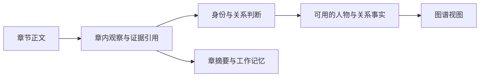
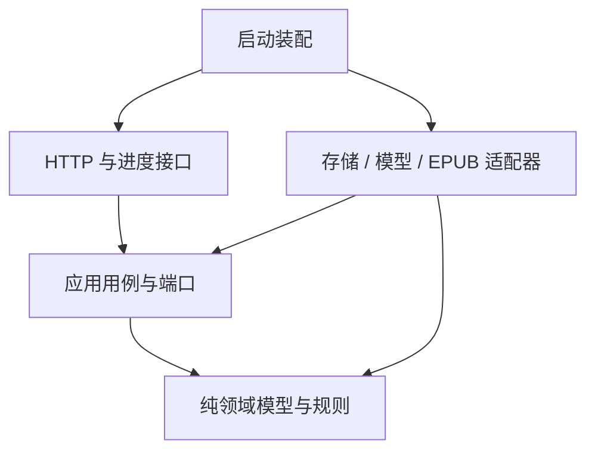
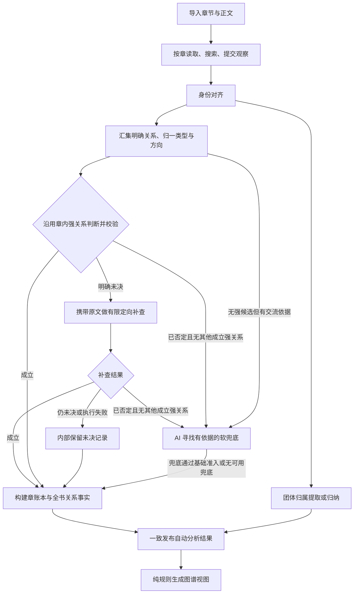

# Kotlin 重构：领域建模、分层与分析流程梳理

日期：2026-09-24。状态：讨论稿，尚未实施；本轮覆盖完整目标模型，前端保留，不要求旧测试书籍迁移；本期不做人工纠错、加强证据模式与防剧透，首批交付包含团体分区与有向关系，具体故事顺序待细化。

## 1. 依据与本轮结论

**产品行为只依据 [PRD v0.9](../PRD.md)。** [分析流水线](../human/分析流水线.md) 及其评论用于发现问题，代码用于核实问题；[旧架构](../ARCHITECTURE.md) 和 [旧 Python V2 方案](重构方案.md) 均不作为新方案的产品约束。下文的技术选择是建议，不能视为已经采用的架构。

本轮已确认的产品决定已先写回 PRD：

- 软关系作兜底。已有硬 / 中关系时，不再抽取新的软关系；之前已有的软关系保留，默认折叠。
- 兜底仍需实际交流依据。与主角交流是典型场景，不等于只能连接主角，也不等于只要出现就补边。
- 自动补查后仍未达到准入条件的关系内部保留，不进入默认图，不要求用户逐项审核。
- 防剧透移到二期候选特色功能，当前不实现；保留来源章节用于解释、分析与重跑。
- 核心用户尚未读过书；本期不做人工纠错，也不让用户承担结果审核。
- 无姓名但可稳定识别的具体人物收录，用原文稳定称呼显示，不编造姓名。
- 未决硬 / 中关系先进入后续判断；被否定且无其他成立强关系时，再由 AI 寻找有依据的软兜底。仍未决不当作否定处理。
- 本期只做基础证据模式：章节 + 非空说明，引用可选；加强模式及切换后置。
- 保留现有前端和评测集；旧测试书籍无需迁移，质量目标与评测机制由用户另行安排专项制定。
- 别名主要在读章时归属；稳定名称绑定与上下文指代分开，名称索引返回候选集合，不能按首个同名直接合并。
- 取消全量关系复核及通用收尾 Agent；仅对明确未决硬 / 中关系有限补查，逐项保留结果，不阻塞其他合格关系。
- 本轮只更新模型与边界，不开始代码重写，不以完整模型覆盖范围代替实施排期。

**建议方向：Kotlin/JVM 模块化单体，业务按能力分包，依赖按领域、应用、适配、接口分层。** 首先消除共享可变对象和职责混杂，再用 Kotlin 的类型和模块约束防止问题复发。

当前可维护性问题不只来自语言：Python 已有类型模型，但同一个关系对象同时充当模型输入、抽取记录、归一结果、验证状态、落盘结构与接口返回。逐文件翻译为 Kotlin 会保留这些耦合。

## 2. 从 PRD 推导出的能力边界

| 能力 | PRD 依据 | 应负责的事情 | 不应承担的事情 |
|---|---|---|---|
| 书籍与章节 | §5.1、§5.4 | 导入、阅读顺序、正文、分析章选择 | 判断人物关系、管理模型对话 |
| 人物身份 | §5.3、§5.8 | 认人、别名、同人自动归并、稳定无姓名人物识别 | 把同名或共享称呼直接判为同一个人 |
| 关系知识 | §5.5、§5.6、§6 | 类型、方向、多标签、证据、准入、软关系兜底 | 图布局、HTTP、模型厂商协议 |
| 团体归属 | §3.1、§4.5、§5.7.5 | 势力名称、成员、多人多归属 | 把朋友当势力、把邻居布局推断当事实 |
| 图谱展示 | §5.7 | 聚合、折叠、过滤、聚焦、分区、导出数据 | 修改账本、调用模型重新认人 |
| 分析执行 | §5.4、§8、§9 | 调度、缓存、进度、取消、重跑、发布结果 | 决定师徒是否成立、兜底是否有依据 |

本期不建人工纠错用例、编辑覆盖层与审核队列。身份、关系、团体的问题由系统在所属能力内自动处理；不能因为用户尚未读书而把判断留给用户。章摘要是分析的工作记忆，不成为另一套事实来源。

## 3. 已核实的问题与重构去向

以下是当前代码观察，不是要沿用的产品规则。

| 当前问题 | 核实位置 | 根因与建议 |
|---|---|---|
| 正式名相同就合并，别名查询取第一个结果 | `backend/app/agent/cast_writer.py::apply`、`models/cast.py::find_by_name`、`agent/tools.py::propose_persons` | 名称被当成身份。改为名称索引返回候选集合，再由身份决策绑定 ID |
| 抽取提示声明没有固定类型列表，关系可以不断造词 | `backend/app/agent/prompts/chapter.py` | 与 PRD 半开放类型库不一致。优先提供已知类型，只为确有必要的语义提交新类型建议 |
| `Relation` 同时存原始描述、规范类型、证据和状态，多阶段就地改写 | `backend/app/models/ledger.py`、`agent/relation_normalizer.py` | 分开原始观察、类型决策、语义判断与正式事实 |
| 原句定位会重置关系为待确认；定位失败仍返回提交成功 | `backend/app/core/evidence.py::locate_evidence`、`agent/tools.py::submit_relations` | 文本校验不应修改语义判断；非法摘录在工具调用当场返回可修正错误 |
| 归类与核对都以原句唯一定位为前置条件 | `backend/app/agent/relation_normalizer.py`、`relation_verifier.py` | 把“引用是否有效”与“关系是什么、是否成立”混为一谈；也堵住 PRD 的基础证据模式 |
| 按章归类，有完全相同描述的任务缓存，但不是全书语义去重 | `backend/app/agent/relation_pipeline.py`、`relation_normalizer.py::_cache_key` | 先汇集可复用的语义问题再判断；不同证据上的真伪结论不能跟着语义缓存复用 |
| 核对固定携带原句前后各 800 字，未决结论不进入补查 | `backend/app/agent/relation_verifier.py`、`core/suspects.py` | 按句 / 段组织上下文，语义未决应回到所属问题的有限补查 |
| 总校对接收人物交叉、双向关系、摘录错误，并通过补丁改多份数据 | `backend/app/core/reconcile_service.py`、`patch_applier.py` | 身份问题交身份解析；语义问题交关系判断；文本错误在入口处理。取消通用收尾补丁通路 |
| 类型没有硬度字段，展示分仅排序，所有已确认关系参与者均绕过路人过滤 | `backend/app/domain/relation_types.py`、`core/aggregator.py::compile` | 引入明确的硬度与显示策略；按 PRD 保留硬关系人物、聚焦人物，其他按阈值处理 |
| 书状态、任务状态、章状态及校对阶段互相嵌套；调度还管理 SSE、存储和发布 | `backend/app/core/orchestrator.py`（当前 1,216 行） | 拆用例、任务运行器、进度输出和结果提交；阶段是进度信息，不是领域事实状态 |
| t7887it78t787t878tt78tp79pt997y8978908900u9u809u8090ID 再匹配 | `backend/app/core/rebuild.py`、`storage/filestore.py` | 保留“新结果成功后替换”的能力，改为显式结果版本和提交边界 |
| 评测直接遍历账本关系，没有按最终图准入口径过滤 | `eval/siddhartha/evaluate.py::evaluate`（关系读取段） | 抽取召回和产品图质量分开统计；未决、否定结果不能算用户已得到的正确关系 |

历史固定输入报告支持取消旧循环：[Phase 1 对照](../../eval/siddhartha/reports/phase1_summary.md) 中疑点由 29 降为 3，收尾仍用完 12 次请求且未提交，收尾 tokens 从 110,665 降为 61,655。旧评测不按关系状态过滤，77.72 不代表实际可见图质量不变；这些报告也不是完整的有 / 无复核消融实验，不据此推断所有针对性判断都无效。质量指标仍交后续专项，不新增本期评分门槛。

当前也有应保留的工程能力：原始抽取快照、单章缓存、有限并发、请求预算、任务进度与重跑隔离。人工编辑属于旧系统能力，本期不迁入。保留的是能力与相应测试，不是旧文件布局或类的职责。

## 4. 数据模型：先区分观察、判断、事实和视图



“章内观察”是系统收到的候选，不因成功保存就成为已成立事实。正式章账本保留来源并关联判断结果；图是它的派生视图。摘要只提供上下文，关系结论必须回到正文依据。

这些是语义边界，不要求为每个名字建立数据库表、一个服务或一道模型调用。

### 4.1 书籍、章节与摘录

| 模型 | 关键字段 | 不变量 |
|---|---|---|
| `Book` | `BookId`、标题、作者、源文件引用 | 书的身份不随分析任务改变；不塞入整个任务运行状态 |
| `Chapter` | `ChapterId`、书 ID、顺序、标题、正文版本 | 章节 ID 与排序分开；导入修订不能悄悄改变已有引用含义 |
| `TextSpan` | 章节 ID、正文版本、起止位置、坐标单位 | 区间必须属于该版本正文；起点小于终点且不越界 |
| `EvidenceRef` | 证据 ID、原文片段集合，或基础模式的章节与说明 | 有引文时由程序按区间读取，各片段保持分离；无引文时不得伪造定位成功 |
| `ChapterExtraction` | 抽取 ID、章节 / 正文版本、模型与提示版本、观察集合 | 已提交的原始输入记录不可被后处理就地重写；重跑产生新记录 |
| `ChapterSummary` | 章节 ID、摘要、所属抽取版本 | 仅用于记忆，不被聚合器当作关系来源 |

导入器负责 EPUB 结构转换；“哪些内容值得分析”应是可检查的章节选择结果。旧实现的“少于 200 字直接丢弃”等阈值没有 PRD 授权，不能成为新导入器的需求；实施前用短章、序章、目录混排样例确定规则。

证据工具优先让模型选择程序返回的片段 ID；也可提交摘录与位置，由程序核实。重复出现的同一句可以通过位置选定，不能仅因全文出现两次就判为无效。

正文引用与评测 fixture 回放必须明确字符坐标。Kotlin `Char` 是 UTF-16 代码单元，补充平面字符可能占两个位置；旧 Python 位置不能原样当作 Kotlin 下标。本期不迁移旧书运行数据；评测样例若复用旧位置，应按正文版本和引文重新定位，新接口明确坐标单位，测试覆盖扩展汉字、表情、换行与 EPUB 文本清洗。参见 [Kotlin 字符说明](https://kotlinlang.org/docs/characters.html)。

### 4.2 人物与名字

| 模型 | 关键字段 | 用途 |
|---|---|---|
| `PersonMention` | 提及 ID、章内局部人物 ID、名称 / 称呼、上下文与来源引用 | 记录“本章提到了谁”，包含无姓名但稳定可识别的人物；无需覆盖每个代词 |
| `Person` | 稳定 `PersonId`、正式名或稳定称呼、别名、简介、性别、重要度 | 书内人物身份与当前资料 |
| `NameBinding` | 名称、人物 ID、名称种类、来源章、归属依据 | 已成立的正式名 / 别名 / 稳定称谓绑定；按名称检索返回候选集合，不施加名称唯一约束 |
| `IdentityDecision` | 被处理的提及 / 人物、同人 / 不同人 / 未决、依据 | 明确谁与谁是同一个人，保留决策来源 |
| `IdentityMap` | 局部人物引用到书内人物 ID 的映射 | 所有关系端点都通过同一份映射解析 |

无姓名人物用书中稳定称呼建立身份，例如能够持续区分的“摆渡老人的妻子”；不凭空补姓名，也不把所有“老人”合成一个人。泛指群体与职业类别不等于可稳定识别的具体人物。

“乔达摩 / 佛陀”可进入同人候选，是否同人以本书上下文为依据；“父亲 / 先生 / 师父”本身不能桥接一大群人物。规则负责找候选，只有真正等价的证据支持自动归并；信息不足时保留多个身份，符合 PRD §5.3。

候选组不等于合并组：A 像 B、B 像 C，不足以推出三者全部同人。模型可返回多个子组与未决项，程序校验覆盖范围、未知 ID 与矛盾决策。

合并不应靠全项目搜索替换 ID。保留稳定身份引用与合并映射，由结果构建统一重映射关系、事件和团体成员；合并后产生自环的关系需重新处理，不能直接出图。

人物 ID 独立于展示名，后来补充正式姓名不新建身份，也不改写关系的业务归属。`Person` 的别名列表由已成立的名称绑定投影，避免两套写入来源。“父亲 / 师父 / 那个老人”的单次指向记录在 `PersonMention` 及身份映射中，不自动写为全书别名；只有原文支持稳定归属的称谓才进入名称绑定。

当前只需要来源追踪和当前身份映射，不实现按阅读章节回放的历史人名册。

### 4.3 关系、类型与互动

| 模型 | 关键字段 | 边界 |
|---|---|---|
| `RelationType` | 类型 ID、定义、硬度、方向、两端角色、同义名称、内置 / 书内来源 | 半开放数据，不能把 40～60 个类型写死为不可扩展的 Kotlin 枚举 |
| `RelationCandidate` | 候选 ID、局部人物端点、已知类型引用或新类型建议、原文描述、证据 | 原始关系观察，不带模型自己决定的“已确认”标志 |
| `InteractionObservation` | 两个人物、交流描述、证据引用 | 为软关系兜底保留的输入；不是自动入账的一种关系 |
| `TypeResolution` | 候选 ID、规范类型、端点方向映射、理由 | 回答“属于什么关系”，不回答“原文是否证明它成立” |
| `RelationAssessment` | 候选 ID、语义结论、依据、未决原因、判断来源 | 保存章内首次判断或定向补查结论，支持多个证据片段；不是强制独立模型调用 |
| `RelationOccurrence` | 稳定记录 ID、人物端点、类型、来源章、证据、判断引用 | 章账本中的关系记录，保留未决 / 否定记录用于追踪 |
| `RelationFact` | 规范关系键、通过准入的记录 ID 集合 | 为出图聚合的关系事实；同一对人物允许多种事实并存 |

关系键建议为 `(BookId, PersonId A, PersonId B, RelationTypeId)`。无向关系统一端点顺序；有向关系按类型定义的角色顺序存储，不能一律排序。例如“甲是乙的父亲”和“乙是甲的孩子”须连同角色转换后再归一。

硬度只表示关系的产品分类与显示规则；证据支持度是另一维。一条“亲子”候选可能未决，一条“相识”关系可以有充分依据。类型基础分、出现章数、证据加分不能把未决关系变成成立事实。

不推导 PRD 未要求的完整亲属逻辑系统，也不把每种行为建立为新类型。比如“告别后走入树林”主要是事件；它可以帮助解释两个人的交往，不能直接成为“告别并入林关系”。特殊关系是否值得新增，通过少量正反例明确边界。

### 4.4 拆开三种结果，不扩张成大状态机

| 问题 | 建议结果类型 | 处理者 |
|---|---|---|
| 输入是否合法、引用是否有效 | 合法 / 结构错误 / 引用错误 | 程序，工具边界即时反馈 |
| 语义是否成立 | 有支持 / 未决及原因 / 有反证 | 语义判断；上下文不足可有限补查 |
| 是否满足当前准入政策 | 准入 / 尚不满足及原因 | 程序按本期基础证据条件与判断结果决定 |

供应商超时、取消、预算耗尽属于执行结果，不等于“原文无法证明”。缺少原文引用在 PRD 基础模式下也不自动等于不成立；但提交了一条对不上的引文仍是输入错误。

Kotlin 可用 `sealed interface` 表达带理由的结果分支，用 `@JvmInline value class` 区分人物 ID、候选 ID、证据 ID，避免所有 ID 都可互传。有限分支与穷尽检查参见 [sealed 类型](https://kotlinlang.org/docs/sealed-classes.html)，ID 封装参见 [value class](https://kotlinlang.org/docs/inline-classes.html)。

领域对象采用不可变快照；不能仅因使用 `data class` 和 `val` 就共享可变集合。外部 JSON、持久化记录、领域对象、HTTP 返回分别在边界映射。

### 4.5 势力与图数据

| 模型 | 职责 |
|---|---|
| `AffiliationGroup` | 学校、机构、家族或生活圈等团体及其名称来源 |
| `Membership` | 人物属于某团体的记录、角色、来源依据；一人可有多条 |
| `LayoutPartition` | 当前图如何分块；显式团体与算法推断分区可区分 |
| `GraphView` | 当前图节点、边、可见标签、折叠标签、分区、过滤原因和导出范围 |

团体事实与布局推断分开：算法为了摆图把某人放到附近的块，不足以证明他属于该组织。团体抽取可以利用章节观察和摘要检索线索，但成员事实需要回到正文；不能只从已经过滤掉大量边的默认图倒推全部团体。

本期不定义 `Correction` 聚合、人工编辑持久化与合并覆盖机制；这些能力不是自动结果发布的前置条件。后续若决定支持非核心用户手动校图，再单独设计，不提前为其增加当前复杂度。

`GraphView` 只读正式结果：多标签先聚合，再执行软标签折叠和人物过滤。未决记录与“已成立但默认折叠的软关系”必须分开，前者不能借“更多”混进已确认关系。

### 4.6 任务与分析结果版本

- `AnalysisRun`：一次执行的范围、输入版本、预算、进度、章尝试、失败原因和取消情况。
- `ChapterAttempt`：某章一次尝试及抽取产物引用。某章失败不等于其他章失败。
- `AnalysisRevision`：一套彼此一致的人物映射、关系结果、类型定义和团体结果；记录输入抽取与策略版本。
- `PublishedRevision`：当前对外可读结果的指针。

任务状态可保持简单：等待、运行、完成、失败、取消；完成结果另带完整 / 部分完成说明。章节覆盖、关系未决数与势力是否过期是结果质量信息，不复用同一个字符串状态。

没有通用 `reconcile_failed` 领域状态。任务失败时，上一套已发布结果仍可读取；是否发布本次部分成功章、失败后自动重试多久等用户可见行为，需在对应故事细化时补入 PRD。

## 5. 分层与依赖方向



箭头表示编译依赖。运行时应用调用自己定义的端口，外部适配器实现端口。

| 层 | 放什么 | 禁止什么 |
|---|---|---|
| 领域层 `domain` | 人物身份约束、关系方向、类型定义、准入与软关系规则、图投影纯计算 | 网络、文件、数据库、模型 SDK、HTTP 类型 |
| 应用层 `application` | 导入、分析、重跑、出图用例；事务边界、预算、任务调度；外部能力端口 | 厂商响应格式、SQL、文件路径操作、提示词拼接 |
| 适配层 `adapters` | EPUB 解析、模型请求与工具协议、存储实现、进度传输实现 | 自行决定业务规则、直接跨模块改人物或关系 |
| 接口与装配 `server` | 路由、请求 / 响应 DTO、错误映射、依赖装配 | 在路由里做关系归一、直接调用模型或改数据库 |

建议初始只用四个 Gradle 模块，模块内部按业务包组织。不要为每个实体或每个判断建一个独立工程。

```text
backend-kotlin/
  domain/         library, identity, relations, affiliations, graph
  application/    importbook, analyze, rerun, graphquery, ports
  adapters/       epub, llm, persistence, telemetry
  server/         http, bootstrap
```

领域包的最小公共部分只放 ID、来源引用等值对象；避免新的 `core`、`utils`、`common` 大杂烩。分析运行元数据归应用层，不让每个业务实体都依赖调度器。

核心用例建议是 `ImportBook`、`AnalyzeBook`、`RerunChapter`、`GetGraph`、`ExportGraphData`。内部的身份解析、类型归一、语义补查是协作步骤，不要求各有一个 HTTP API。

端口按需求定义，例如章节读取、抽取、身份判断、关系判断、结果存储。不要只暴露一个无类型的 `ask(prompt): String` 给整个应用层，也不为每个纯函数制造接口。

章 Agent 的工具处理器是适配器：调用应用提供的“读原文 / 查询候选 / 提交观察”能力。它持有本章范围内的上下文，没有全库随意写权限。程序校验失败返回结构化错误供本轮修正，不把异常包给另一个 Agent。

技术落地方向暂建议 Ktor 作为 HTTP 适配器、协程作为任务执行机制；框架不进入领域层。Ktor 的 [测试宿主](https://ktor.io/docs/server-testing.html) 可直接测试 HTTP 契约。框架、JDK、依赖版本与模型 SDK 在首个技术验证中锁定，本轮不安装依赖。

## 6. 目标分析流程：明确关系优先，软关系最后兜底

当前主路径是：并行抽取 → 同名合并 → 按章归类 → 逐批核对 → 通用校对补丁 → 势力抽取 → 出图。

建议目标如下。图中是职责顺序，不代表每个框都要调用一次模型。



### 6.1 章分析：读完整，但不无限造关系标签

输入是章节正文、可用人名册、类型库和预算；长篇记忆属于后续可插入能力。章 Agent 仍可自行决定阅读、搜索与取证方式，符合 PRD“过程松、出口紧”。

输出分三类：人物观察及名称归属、包含首次语义判断的明确关系候选、可供兜底的实际交流观察，外加独立摘要。事件可选；交流观察只保留足够支撑判断的片段，不建设全量事件抽取系统。

- 高频关系优先引用类型库；新类型提交定义、角色与方向供归一，不能把整个情节句子当标签。
- 已知某人物对有硬 / 中关系时，不再要求该对生成软标签；本章新关系也先处理明确类型。
- 实际交流观察可作为后续判断依据，但不提前命名为“朋友”。已经用于明确关系的交流证据无需重复复制。
- 错人物 ID、越界片段、错引文在工具边界退回修正。正常模型候选与失败工具调用分开保存。
- 本期只实现基础证据准入：必须有章节与非空说明，引文可选。提供引文时校验真实性；没有引文时不能被唯一定位闸门挡住。不实现加强模式或模式切换。

### 6.2 身份对齐：候选检索与合并决策分开

章模型读取正文时，同时完成主要身份判断：返回局部人物、名称归属、来源章节、简短理由，以及可匹配的已有 ID。程序按名称检索候选列表并复用明确绑定；即使命中已有 ID，也要保存新别名，不能提前返回而丢失增量资料。

同名或别名交叉只产生候选，不自动触发合并。真正的歧义才做针对性判断：应用预先打包候选人物资料、相关提及及各自原文上下文；模型返回结构化身份结论，程序校验后更新映射。不对全部名字另跑一遍审核，也不启动自由搜索全书的收尾 Agent。

相关候选可在条数与输入长度上限内批量处理，逐项保存结果。信息不足的身份保持独立并记录内部疑点，不阻断其他人物的关系出图，不要求人工合并。

### 6.3 全书关系归一与语义判断

先在本次有效分析范围内汇集候选，确定性匹配已有类型；对剩余语义相近的描述组织有界批次。先做精确去重与类型检索，再判断真正歧义的部分。

缓存必须分开：

| 缓存 | 适用范围 |
|---|---|
| 类型语义决策 | 定义、双方角色、方向等等价的问题可跨章复用；类型库与策略变更需失效 |
| 证据语义判断 | 仅复用相同人物解释、规范类型、正文版本与证据上下文的判断 |
| 章抽取 | 正文、相关输入、提示、模型配置等未变时可复用 |

“多章都用了朋友这个词”可以共享类型定义，不能共享“这些人物确实是朋友”的结论。身份合并或类型方向改变后，对相关证据判断重新校验。

**本期取消全量关系复核门禁。** 清晰候选沿用章内首次语义判断，经结构与基础证据校验后准入；不默认让只看到局部片段的第二个模型否决完整读章的判断。仅明确未决的硬 / 中关系进入 §6.4；软兜底不走通用复核。“已成立 / 未决 / 已否定”是结果状态，不对应三个 Agent。

### 6.4 有限补查：接住真正的语义问题

仅处理明确未决的硬 / 中关系。未决原因用有限类型表达，说明本次缺什么，而不是只有一个 `pending` 字符串；方向上同时存在两条关系不自动等于语义矛盾。

| 原因 | 后续动作 |
|---|---|
| 指代或说话者不明 | 回到身份上下文，补相邻对话或相关提及 |
| 类型 / 方向含糊 | 附类型定义与双方角色，重新判断具体区别 |
| 当前片段不足 | 扩充句子或段落上下文，必要时由应用准备有限相关章节片段 |
| 比喻、尊称、传闻等无法确定 | 针对疑点补查；仍不足则保留未决 |
| 供应商失败 / 超时 | 走执行重试政策，不伪造语义否定 |
| 摘录本身不合法 | 原工具立即反馈，不进入语义补查 |

上下文从原句、相邻句和所在段落开始；按对话边界处理指代，必要时有界扩展。按句切分也会出错，不能硬编码成“任何情况前后各两句”。同一上下文支持多条候选时共享片段，保留证据与候选对应关系。

应用在调用前准备候选 ID、具体疑问、首次判断及理由、人物与别名上下文、来源章和相关原文。基础模式引文可选，不意味着补查只能收到摘要或关系名称；原文由来源信息获取，不把找回已读上下文的任务重新交给开放式工具循环。

补查返回结构化结论，单项或有界小批处理；条数、输入长度、请求次数和耗时上限由应用控制，具体数值在实施故事中确定。逐项保存已完成判断，不要求处理完所有问题再提交一次大补丁，不再复核补查结果。达到上限后仍未决的内部保留，其他合格结果继续出图；单项未决或失败不回滚其他已完成判断。取消通用收尾 Agent 及其跨领域补丁入口。

### 6.5 软关系兜底的时机与规则

**有未决强候选时，软标签生成必须等后续判断；候选被否定且无其他成立强关系后，再调用 AI 找兜底。** 从未产生强候选但有交流依据的人物对，按普通兜底路径处理。各章仍可并行收集交流证据，避免为了确认“已经有强关系”而把整个读章阶段串行化。

| 人物对的情况 | 处理 |
|---|---|
| 已有成立的硬 / 中关系 | 跳过新的软关系生成；历史已记录软关系保留、默认折叠 |
| 没有硬 / 中关系候选，有足够实际交流依据 | 由 AI 根据依据生成粗粒度兜底标签，仍须通过基础准入 |
| 只有出现在同一章，没有交流依据 | 不因共现就补软边 |
| 有历史软关系，后来新增硬 / 中关系 | 保留旧软记录，默认突出强关系；“更多”可见旧软标签 |
| 有未决的硬 / 中候选，同时有明确交流 | 先进入后续语义判断，不抢先生成替代软关系 |
| 上述候选经后续判断被否定 | 若无其他成立的硬 / 中关系，由 AI 回看交流与上下文寻找兜底；兜底也须通过基础准入 |
| 后续判断仍未决，或只是超时 / 预算耗尽 | 内部保留，不把未决或执行失败当成否定来触发兜底 |
| AI 未找到有依据的兜底 | 不强行补边，保留原强关系被否定的记录 |

这里“历史已有”指之前已入账的记录，不能把本轮所有交流观察先转换成软关系，再宣称它们都要保留。并行章节内先后完成的时序不应决定同一批分析最终生成多少软标签。

为保留已入账软关系，记录其首次准入及来源。后续增加章节时，只对新候选执行“不再新增”政策，旧记录按显示规则折叠；原来源在重跑中被纠正或失效时应重新评估，不能无条件保留错误事实。

### 6.6 出图与势力

应用用例加载同一结果版本，领域规则完成：人物归一 → 多标签汇总 → 默认折叠软标签 → 人物过滤 → 聚焦 / 类型筛选 → 分区数据。

- 相同类型合并出现章节与证据，多种硬 / 中关系并列保留。
- 人物出现次数按章去重计数；默认阈值 2，硬关系参与者和聚焦人物按 PRD 例外保留。
- 一个普通人物不能仅因有一条软边就绕过人物过滤。是否为“主角”额外保留，不从旧代码自动继承，应在故事中明确。
- 图上的分数只用于排序 / 展示，不能决定事实成立；导出 JSON 与页面共用图数据构建结果。
- 势力事实独立于关系边。分区失败的降级规则沿用 PRD §4.5 的目标，不把无声退回百人单层布局视为完成。

防剧透暂不进入查询流程。现在只区分“分析了哪些章节”和“当前结果版本”，不实现历史身份回放、章节切片缓存、未来信息可见性计算。后续开启防剧透时需重新设计完整语义，不能仅在当前图上裁掉晚章关系边就宣称支持。

## 7. 存储、并发与重跑

### 7.1 建议用事务表达一致性

建议本地 / 私有部署先采用 SQLite 存结构化记录，正文和源 EPUB 用不可变文件引用保存。选择理由是一次人物合并、关系更新和结果发布需要一致提交；不是因为旧架构提到过 SQLite。

概念上的存储集合为：书与章节、抽取记录、人物与身份决策、关系类型与判断、章账本 / 正式结果、团体归属、任务进度。首版不必全部关系表化，低查询频率的抽取载荷可存带版本的 JSON；需要约束和索引的 ID、引用、版本关系显式保存。

模型请求不持有数据库事务。各章产物先独立保存，构建新结果时写到未发布版本，最后用短事务验证引用并切换当前版本。SQLite 同时只有一个写事务，写入需短且串行协调，遇到繁忙采用有界重试；参见 [SQLite 事务说明](https://sqlite.org/lang_transaction.html)。

如果先保留 JSON 存储，也应实现相同的存储端口与发布契约；文件原子写不能自动保证多文件组成的结果原子一致。无需引入分布式事务、消息队列或通用事件溯源平台。

### 7.2 运行与结果分开

建议一个书籍同一时间只运行一个会发布结果的任务，不同书可以独立执行；同书章节可并行，模型调用还有统一并发与预算限制。

应用层掌握取消和超时。正常完成、用户取消、供应商错误、部分章失败分别记录；取消信号不能被通用异常兜底吞掉。任务进度写入运行记录，HTTP 订阅只负责传递进度，断开页面不决定任务是否存活。

发布时校验输入抽取版本及当前发布版本未被其他任务改变。图查询在一次请求中固定结果版本，避免刚读完新人名册又读到旧关系账本。

### 7.3 单章重跑的建议契约

1. 只重抽指定章，其他章有效原始抽取直接复用。
2. 以有效抽取及已记录且输入未变化的判断构建新结果；不把旧模型补丁层当成新的原文事实。
3. 重算受人物归并、类型变化影响的全书派生关系。首版可以全书重建派生数据，但不等于重新调用所有模型。
4. 按来源保留仍有效的旧软关系准入记录；重新校验因重跑而失效的依据。
5. 校验结果一致性后发布；失败保留本系统上一版结果，新失败运行仍可诊断，不需要人工审查。

本期不要求兼容旧 Python 书籍 ID；Kotlin 内部仍须保持人物 ID、类型 ID 和有效来源引用在重跑中的稳定性，避免身份漂移与重复关系。

## 8. 现有模块的处理范围

| 当前模块 | Kotlin 目标 |
|---|---|
| `models/*` | 拆为领域模型、持久化记录、工具 DTO、API DTO，边界映射 |
| `core/orchestrator.py` | 分析用例、任务执行器、进度端口、发布服务 |
| `agent/chapter_agent.py`、`agent/tools.py` | 章阅读适配器、本章工具处理器、提交观察用例 |
| `agent/cast_writer.py`、人物合并补丁 | 身份候选编译、身份决策、统一映射 |
| `relation_normalizer.py`、`relation_verifier.py` | 保留类型归一能力；移除全量复核阶段，沿用章内判断，仅明确未决硬 / 中关系定向补查 |
| `core/suspects.py`、`reconcile_service.py`、`reconcile_agent.py` | 删除通用收尾 Agent；身份歧义归身份解析，摘录错误在入口修正，语义疑点有限补查 |
| `patch_applier.py`、`core/rebuild.py` | 只保留自动结果版本构建与事务发布职责；人工补丁能力本期不迁入 |
| `core/evidence.py`、`core/parser.py` | 文本坐标校验纯规则、EPUB 外部格式适配 |
| `core/aggregator.py`、`faction_resolver.py` | 图投影、软标签折叠、人物过滤、团体分区规则 |
| `storage/filestore.py` | 有类型的存储端口与新存储实现；不要求兼容旧书文件结构 |
| `api/*` | HTTP DTO 转换与应用用例调用 |
| 前端 `api.ts`、图谱 / 进度组件 | 确定保留现有 TypeScript 前端并适配新契约；本期界面不保留必须校图或审核的流程 |
| `eval/siddhartha/*` | 保留评测数据与 fixture；评分机制、平台、指标及门槛由专项另行制定 |

API 可保留书籍导入、启动分析、取消、任务进度、人名册查看、图、单章重跑、导出的用户能力；不以兼容 `reconcile_done`、旧阶段名等内部细节为目标。接口结构变更通过保留的前端同步适配完成，不要求兼容旧人工编辑 API，不能污染领域模型。

按阅读进度的图参数与滑块不列为当前必须移植能力。分析范围选择仍然有效，两者在 API 与前端语义中应明确区分。

## 9. 质量、性能与验收

### 9.1 自动测试的职责

| 测试 | 验证内容 |
|---|---|
| 领域单元测试 | 名称歧义、稳定无姓名人物、方向归一、基础准入、多标签、否定后软兜底、过滤 |
| Gherkin 验收 | 产品故事从输入到可见结果的行为；用可控模型替身使规则测试稳定 |
| 集成测试 | 数据库事务与回滚、重跑、并发任务、发布一致性、取消、HTTP / 进度契约 |
| 真实模型评测（另行专项） | 保留输入 / 输出与运行记录，具体评分机制及质量门槛等待专项制定 |
| 架构检查 | 领域不依赖外部框架，接口不直连存储，业务包无不合理循环 |

按 AGENTS.md，函数行为须有单元测试支撑，产品行为须映射 Gherkin 验收。可以由同一故事覆盖多个协作函数，但不能用“有一份 feature 文件”代替真实行为断言。不要给 DTO 字段抄一遍无意义断言来提高数字。

建议先选择的规则样例（不是已确定的实施批次）：

| 样例 | 应验收的行为 |
|---|---|
| 两个人都被称作“先生” | 未得到同人依据前保持独立身份 |
| 同一名称命中多个人物 | 返回候选集合，不选首项自动合并 |
| 已有人物在新章获得明确别名 | 复用人物 ID，同时保存新绑定及来源 |
| 不同说话者使用“父亲” | 依上下文分别绑定提及，不添加全书通用别名 |
| 无姓名人物后来获得正式名 | 更新展示名及绑定，人物 ID 与关系归属不变 |
| 章内判断清晰且满足准入 | 直接形成合格记录，不调用独立关系复核 |
| 软兜底满足基础准入 | 不进入通用关系复核 |
| 多个疑点中一项超时 | 已完成判断保留，未决内部留存，不等待统一收尾补丁 |
| 同一对人物同时存在师徒与夫妻 | 两种标签保留，不互相吞并 |
| 已有师徒，又发现普通交流 | 不再新增软关系标签 |
| 已有相识，后来发现亲子 | 相识保留在“更多”，默认突出亲子 |
| 与主角实际交流，无更明确关系 | 可生成有依据的兜底标签，不自动推成朋友 |
| 只有同章共现 | 不为补全图而自动连边 |
| 引文出现两次，提供了有效位置 | 能正确引用选中的片段 |
| 引文对不上正文 | 当次提交返回摘录错误，不启动总校对 |
| 基础模式缺引用但有章节和合格说明 | 走基础准入判断；不因无引用直接被技术闸门永久排除 |
| 补查后仍未决 | 内部保留，默认图无该关系，其他已准入结果可出图 |
| 新版本发布中途失败 | 查询仍得到完整旧版本 |
| 强候选后续被否定 | 无其他成立强关系时调用 AI 寻找兜底，不把否定的强标签直接改成软标签 |
| 强候选仍未决或供应商超时 | 不触发该候选的否定后兜底路径 |
| 无姓名但可稳定识别的人物 | 收录并显示稳定称呼，不误并同称呼的不同人物 |
| 未读过书的用户完成分析 | 无需合并人物、改关系或确认待办，即可浏览合格结果 |

可先写成以下场景轮廓，再由对应故事补充具体类型数据和步骤实现：

```gherkin
# language: zh-CN
功能: 软关系作为兜底
  场景: 已成立师徒关系时不再补相识标签
    假如 甲与乙已有通过准入的师徒关系
    而且 新分析的章节记录了甲与乙的普通交流
    当 系统完成本次关系归纳
    那么 不新增甲与乙的相识关系
    而且 默认图保留师徒标签

  场景: 后来确认亲子时保留之前的软关系
    假如 甲与乙之前已有通过准入的相识关系
    当 新分析确认甲是乙的父亲
    那么 默认图突出亲子关系
    而且 原来的相识关系可在更多关系中查看
```

### 9.2 工程门禁

依据 AGENTS.md：函数须有注释；复杂内部逻辑块 CC 大于 6 时解释意图；函数 CC 不超过 12，超出需重构。Kotlin 版应明确复杂度统计规则，防止利用长链式表达式或拆成空壳函数绕过门禁。

先建立模块依赖白名单和架构图，再写故事代码。可用 JVM 字节码依赖检查来约束 Kotlin 编译结果；[ArchUnit](https://www.archunit.org/userguide/html/000_Index.html) 提供包依赖、层约束与循环检查。具体检查器与覆盖率工具在骨架验证时确定，覆盖率数值阈值不在本轮凭空指定。

源码变异优先覆盖：错误合并、方向反转、硬度判断、忽略证据策略、未决误出图、发布失败仍切换版本。Gherkin Examples 的变异需说明预期：修改反例输入而保留独立断言，应暴露边界错误；不能同时修改输入和期望来制造“通过”，也不能把任意数据变化后仍通过都算漏测。先区分等价变异、应改变结果的变异和无效测试数据。

### 9.3 评测数据保留，机制与目标交给专项

质量目标、指标口径、评分机制与评测平台由用户另行安排专项制定。本轮不选择 Promptfoo 或其他平台，不实施评测机制重构，不设定“90 分”等数值门禁；后续确认的产品质量目标写回 PRD。

保留 `eval/siddhartha/` 的 Gold、原始 fixture 及相关数据，保持可追溯。保留评测集不等于迁移旧测试书籍，也不意味着旧 evaluator 的综合分被认可。若样例引用旧运行目录，专项应将必要原文整理为自包含评测材料；本轮不删除任何旧数据。

当前实现设计只保留可交付给专项的基础材料：抽取输入 / 输出、正式关系判断、最终图数据、未决 / 否定原因，以及请求数、tokens、耗时等运行记录。工程单元测试、Gherkin 行为验收、事务与架构检查继续按各自职责设计，不用产品评分机制替代。

未决、否定、已准入与默认可见结果必须可区分，方便后续专项定义口径。旧 Gold 与已确认产品规则不一致之处留给专项复核，本轮不为了旧分数修改产品规则或改写评测集。

### 9.4 正确性与性能风险

| 风险 | 控制与验证 |
|---|---|
| 错误合并导致大量关系串人 | 名称不是身份；身份正反例独立验收；合并影响统一处理 |
| 软兜底覆盖过宽或过窄 | 明确实际交流依据、类型下限；单独看孤立人物与错误软边，不只看总关系数 |
| 稀有关系被粗类型吞掉 | 对定义、方向、角色验证等价；保留新类型入口 |
| 有限补查损失召回 | 记录未决原因、补查命中与失败率，以离线评测选择预算 |
| 句子切片破坏指代和对话上下文 | 支持段落扩展与有限检索，加入跨句样例 |
| 强关系否定后随意补软边 | AI 重新依据交流判断，兜底单独准入；无依据则不连边 |
| 全书重建时间过长 | 先复用有效判断；区分纯计算重建与模型重跑，测量后再做增量优化 |
| 多人候选两两比较膨胀 | 用名称 / 别名索引生成候选；限制泛称连接；每批有条数及输入长度预算 |
| 类型库或上下文提示膨胀 | 高频类型优先、有限候选检索、同段证据去重，避免全书聊天历史累计 |
| SQLite 写竞争 | 短事务与单写协调；模型调用在事务外，压力测试验证发布延迟 |

每次运行记录分阶段请求数、输入 / 输出 tokens、耗时、缓存命中、候选数、未决原因、补查次数与实际新增合格关系。模型快慢由这些指标和质量测试决定；不把所有小判断都默认升级到大模型，也不在没有对照测试时绑定某个小模型。

## 10. 建议实施顺序与切换策略

已将确认的核心行为整理为 [Gherkin 验收场景](../acceptance/README.md)，包含产品来源、稳定场景编号、测试替身与真实模型评测的边界，以及尚未确定的行为。这些是尚未绑定 Kotlin 步骤的规格，不代表自动化验收已通过。实施时按故事选取场景，补齐步骤并运行；无需等待所有开放问题解决才建立骨架或实现已确认的纯领域规则。

已确认保留前端、免做旧书迁移；团体分区与有向关系均纳入首批交付。下面描述开发依赖顺序，各故事组不代表不同交付批次；失败发布策略等尚待确认。

1. **确定剩余边界样例**：关系 / 事件下限与失败章行为补成少量验收例；如有新的产品决定，先更新 PRD。质量指标由独立专项制定。
2. **建立 Kotlin 骨架与架构门禁**：验证模块依赖、基本 HTTP、模型协议、持久化与 EPUB 读取；输出可查看的依赖图。
3. **第一个垂直故事组**：导入章节 → 可控抽取输入 → 基本身份 / 类型 → 图数据，由保留的前端展示。
4. **身份与多标签故事组**：同名异人、别名同人、稳定无姓名人物、方向归一、多种强关系共存。
5. **后续判断与软兜底故事组**：基础证据模式；强候选否定后让 AI 找兜底；未决、否定和无依据不连边分别验收。
6. **重跑与可靠性故事组**：稳定引用、事务发布、取消和失败恢复；不包含人工编辑或覆盖层。
7. **团体与大图故事组**：已纳入首批交付，完成自动成员归属、分区与百人级验收；人工纠错、加强证据模式、记忆与防剧透均不纳入本期核心。
8. **前端接入与后端切换**：验证新契约、自动闭环与工程验收；产品量化质量结论使用专项后续确认的口径，本轮不沿用旧分数自行判定达标。

切换策略：

- 保留现有 TypeScript 前端，调整接口消费与功能入口，不重写整套前端。不把旧人工编辑界面和 API 当作必须保留的功能。
- Kotlin 使用独立数据目录 / 数据库，从重新导入 EPUB 开始；旧书籍及分析结果都是测试数据，无迁移、旧 ID 映射或历史存储兼容要求。
- 保留评测集及 fixture。评测样例转换与正文整理属于测试材料准备，不扩展成生产数据迁移工程，也不能凭空补造新版抽取协议所需的交流观察。
- 本轮不清理旧书数据。后续切换可保留旧程序供对照或回退，不要求新旧数据双写或反向转换。
- 实施完成并通过届时确认的验收后，将已落地架构写入 `ARCHITECTURE.md`，同步人类说明，删除本稿及已被替代的旧临时设计。

## 11. 仍需后续确定的事项

已决定的无姓名人物收录、基础模式、否定后兜底、前端保留、无旧书迁移和本期不做人工纠错，不再列为开放问题。

| 问题 | 当前边界 |
|---|---|
| 硬 / 中关系的抽取下限 | 用“精神引导、技艺指导、长期共同生活、一次援助”等样例界定类型 / 事件；不能照搬旧提示的“师徒必须拜师” |
| 失败章与部分发布 | 自动重试、结束时如何告知缺章、是否发布部分成功结果需明确；不能让核心用户承担语义审核 |
| 故事实施顺序 | 首批包含团体分区与有向关系，按依赖拆分故事，不再将两者是否交付列为开放问题 |
| 质量目标与评测机制 | 用户另行安排专项，本轮不选平台、不设评分门槛；继续保留评测数据与可对照的运行产物 |

下一步细化故事时，以系统自动产出可用图为闭环；不给核心用户增加人物合并、关系裁决或手动校图任务。
